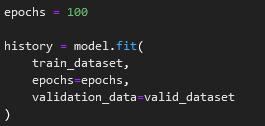
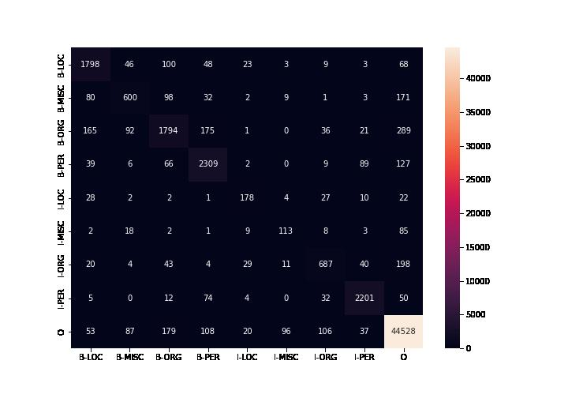

# NLP AI

This git repository is part of a project that implements a chatbot which
impersonates a patient who suffers from cardiovascular diseases.

The project consists of three repositories which contain the logic of the
application:

- Client [nlp-ui](https://github.com/eduard-gp/nlp-ui)
- Server [nlp-server](https://github.com/eduard-gp/nlp-server)
- AI (**this repository**)

## Application Arhitecture

The application has an arhitecture of client-server. There are three components:
a user interface, a web server and a database. The user interacts with the
chatbot using the UI. It is possible to perform the following actions:

- Login
- Create a new patient
- Modify the information of a patient that already exists
- Interact with a patient

The following image describes the workflow of the application:

## NLP AI

This repository contains the details of how to train deep neural networks and
the results that were obtained. The goal of project is to obtain a chatbot that
can impersonate a patient and answer questions from a medical student. The
result of training a deep neural network is a model. The models in this
repository are trained for text classification and named entity recognition. The
task of text classification is used to identify the intention of a question. The
following intentions are of interest for our project:

- chest_pain
- cough_symptoms
- diseases_parents
- diseases_treatment
- faintint_symptoms
- fever_symptoms
- greetings
- palpitations_symptoms
- surgeries
- symptoms_changes
- symptoms_circumstances
- symptoms_parents
- symptoms_start
- visit_reason

For the task of named entity recognition for the Romanian language the labels
from *Dumitrescu, S. D.-M. (2019). Introducing RONEC--the Romanian Named Entity
Corpus. arXiv preprint arXiv:1909.01247* are used.

- PERSON
- NAT_REL_POL
- ORGANIZATION
- GPE
- LOC
- FACILITY
- PRODUCT
- EVENT
- LANGUAGE
- WORK_OF_ART
- DATETIME
- PERIOD
- MONEY
- QUANTITY
- NUMERIC_VALUE
- ORDINAL

For the task of named entity recognition for the English language the labels
from *Erik F. Tjong Kim Sang, F. D. (2003). Introduction to the CoNLL-2003
Shared Task: Language-Independent Named Entity Recognition. arXiv:cs/0306050*
are used.

- LOC
- MISC
- ORG
- PER

## Neural networks

There are two types of neural networks that are trained for the two task
mentioned aboved:

- Recurrent Neural Networks
- Transformers (BERT)

Recurrent neural networks (RNN) are a special type of neural networks that are
specialised to process sequential data and can process data of variable length.
A recurent neural network can be described as a computational graph.

x^(t)^ is the input to time t, h^(t)^ is the hidden state of the RNN at time t
and o^(t)^ is the output at time t. The hidden state of the RNN has the task of
memory so it can retain the information learnt in the previous steps.

Transformers are neuroal networks tha use the concept of attention. The natural
language is complex and some words have a different meaning depending on context
even thought they have the same form. For example, "I go to the bank." and "I
can see the river bank.", the word "bank" has a different meaning in the two
sentences, but has the same form. The concept of attention takes into account
the context where a word is. For moree information please read *Ashish Vaswani,
N. S. (2017). Attention Is All You Need. arXiv:1706.03762*.

BERT or Bidirectional Encoder Representation is a type of transformer that uses
the concept of attention. BERT is a big model that has millions of parameteres.
The model also masks some words when it is the training phase. For further
details about how the models is implemented. please read the original paper
*Jacob Devlin, M.-W. C. (2018). BERT: Pre-training of Deep Bidirectional
Transformers for Language Understanding. arXiv:1810.04805*.

### Datasets

The datasets for training are in the directories:

- datasets (used for named entity recognition)
- database/text_classification (used for text_classification)

The datasets in database/text_classification were processed from raw data from
wit_ai. The directory database/dialogs show examples of how a dialog between a
student and patient should be. The scripts for processing the raw data are
located in the database directory. Also, the special syntax used the dialogs is
exmplained in the README.md from that directory.

The data exploratory analyzes for the task of text classification is presented below.

| Dataset text classification | Items | Average character length per item | Unique words |
|-----------------------------|-------|-----------------------------------|--------------|
| Romanian                    | 215   | 31.44                             | 299          |
| English                     | 95    | 31.35                             | 147          |

The following diagrams describe the dataset for the Romanian language.

The following diagrams describe the dataset for the English language.

The data exploratory analyzes for the task of named entity recognition (NER) is presented below.

| Dataset NER | Items  | Unique words | Number of labels |
|-------------|--------|--------------|------------------|
| Conll2003   | 14 041 | 23 623       | 4                |
| RONEC       | 9 000  | 52 771       | 16               |

The two datasets use the IOB (Inside-outside-beginning) format.

The following diagrams describe the Conll2003 dataset.

The following diagrams describe the RONEC dataset.

These statistics where computed in the files:

- exploratory_data_analysis_conll2003.ipynb
- exploratory_data_analysis_ronec.ipynb

### Training

The project uses Tenserflow to build the neural networks.

#### RNN

The RNN used for text classification and named entity recognition are in the
files:

- rnn_en_text_classification.ipynb
- rnn_ro_text_classification.ipynb
- rnn_en_ner.ipynb

The code to build a RNN is presented below:

`tf.keras.layers.Input` defines that the input of the RNN is of type string.
`encoder` defines how the text is preprocessed before being consumed by the RNN.
`tf.keras.layers.TextVectorization` transforms the text into lowercase, tokenize
it on whitespace and computes how many appearances a token has. Only the first
15 000 tokens that appear the most. This number was selecte to speed
computations and to test how the models behaves when it meets unkown words. The
unkown word has associated the number 1. `tf.keras.layers.Embedding` will
transform the integral representation of a token, computed based on how many
times a word appeared in the input text, into a vector of dimension
`output_dim`. The parameter `mask_zero` specifies that the number 0 is treated
as a mask. `tf.keras.layers.LSTM` is a special type of RNN optimized to process
long sequential text call Long short-term memory.
`tf.keras.layers.Bidirectional` is an wrapper over the LSTM so the text is
processed in both directions. The last layer of the model is of type
`tf.kers.layers.Dense` which output has a dimension equal with the number of
labels that we want to classify and the numeric output represents the score for
a classification.

After the model is defined, it has to be compiled and trained on a dataset.

The model is compiled by calling the method `compile()`. `optimizer` is used to
compute the gradients in the process of backpropagation and `loss` is used to
quantify how good is the model prediction compared to the real value. `metrics`
specifies what type of metrics should be computed for every epoch of training.
This allows us to see how the model is behaving during the process of training.
The training process begins when the `fit()` method is called.

The model for named entity recognition is similar with the one for text
classification, but the output of the neural network should be targeted to every
token of a sentence. The method of how we preprocess a sentence is different
because the numeric representation of a label is computed outside of the model
inside the function `preprocess_tokens()`.

It can be observed that the `tf.keras.layers.TextVectorization` isn't used
because the text tokenization is made outside of the model. The last layer of
the RNN is wrapped inside `tf.keras.layers.TimeDistribuited` because the output
for every token should be a vector with the score associated to every label that
a token can have. The highest score determines the label of the token. To avoid
overfitting a regularization technique is added to the LSTM layer.

#### BERT

The BERT models used for text classification and named entity recognition are
int he files:

- bert_en_text_classification.ipynb
- bert_en_ner_model.ipynb
- bert_ro_text_classification.ipynb
- bert_ro_ner_model.ipynb

The code to build a BERT model for text classification is presented below.

A BERT model is formed from a component to preprocess the text (`preprocessor`) and a component
that computes a vector reprezentation for it (`encoder`).

For the task of named entity recognition an approach similar to the one
presented for RNN is taken, but because the BERT model tokenizes a work in
multiple tokens more attention is needed to be payed to associate the same label
for a word. For more details how this part was implemented take a look at one of
the bert_LANG_ner_model.ipynb files.

The BERT models offered by Tensorflow are already pretrained on a large corpus
of text. There are multiple model that you can use and they differ in the number
of layers (L), the output dimension of a layer (H) and the number of attention
heads (A).

The loss function for the BERT model L=2, H=128, A=2 is presented below for the
task of named entity recognition on the Conll2003 dataset.

The accuracy for the BERT model L=2, H=128, A=2 is presented below for the
task of named entity recognition on the Conll2003 dataset.

The confusion matrix for the BERT model L=2, H=128, A=2 is presented below for
the task of named entity recognition on the Conll2003 dataset.

### Results

#### Text classification

##### RNN

L represents the number of layers and U represents the output dimension for a
layer. Embedding is the dimension of the text vectorial reprezentation.

The results of RNNs for the English language are presented in the table below.

| Layer                  | L     | U      | Embedding | Accuracy   | Precision  | Recall     | F1         | Parameters |
|------------------------|-------|--------|-----------|------------|------------|------------|------------|------------|
| LSTM                   | 1     | 16     | 16        | 0.3534     | 0.3383     | 0.3338     | 0.2051     | 4,478      |
| LSTM                   | 1     | 32     | 32        | 0.5315     | 0.5398     | 0.5398     | 0.4053     | 13,038     |
| LSTM                   | 1     | 64     | 64        | 0.8301     | 0.8179     | 0.8179     | 0.7628     | 42,446     |
| Bidirectional LSTM     | 1     | 16     | 16        | 0.5726     | 0.4292     | 0.4292     | 0.4202     | 6,814      |
| Bidirectional LSTM     | 1     | 32     | 32        | 0.05644    | 0.6408     | 0.6408     | 0.6033     | 21,814     |
| **Bidirectional LSTM** | **1** | **64** | **64**    | **0.9315** | **0.9190** | **0.9190** | **0.9124** | **76,366** |
| Bidirectional LSTM     | 2     | 16     | 16        | 0.3178     | 0.1997     | 0.1997     | 0.2492     | 13,086     |
| Bidirectional LSTM     | 2     | 32     | 32        | 0.5205     | 0.5924     | 0.5924     | 0.6163     | 46,638     |
| Bidirectional LSTM     | 2     | 64     | 64        | 0.9178     | 0.8531     | 0.8531     | 0.8686     | 175,182    |

The results of RNNs for the Romanian language are presented in the table below.

| Layer                  | L     | U      | Embedding | Accuracy   | Precision  | Recall     | F1         | Parameters |
|------------------------|-------|--------|-----------|------------|------------|------------|------------|------------|
| LSTM                   | 1     | 16     | 16        | 0.4118     | 0.314      | 0.3140     | 0.2554     | 7,118      |
| LSTM                   | 1     | 32     | 32        | 0.6290     | 0.6449     | 0.6449     | 0.5065     | 18,318     |
| LSTM                   | 1     | 64     | 64        | 0.8507     | 0.8341     | 0.8341     | 0.7936     | 53,006     |
| Bidirectional LSTM     | 1     | 16     | 16        | 0.4570     | 0.3414     | 0.3414     | 0.2732     | 9,454      |
| Bidirectional LSTM     | 1     | 32     | 32        | 0.6787     | 0.7623     | 0.7623     | 0.6234     | 27,086     |
| **Bidirectional LSTM** | **1** | **64** | **64**    | **0.8462** | **0.8392** | **0.8392** | **0.7676** | **86,926** |
| Bidirectional LSTM     | 2     | 16     | 16        | 0.3891     | 0.3890     | 0.3890     | 0.2368     | 15,726     |
| Bidirectional LSTM     | 2     | 32     | 32        | 0.7376     | 0.8429     | 0.8429     | 0.6483     | 51,918     |
| Bidirectional LSTM     | 2     | 64     | 64        | 0.8552     | 0.7923     | 0.7923     | 0.7556     | 185,742    |

##### BERT

Sequence rerpresents the number of tokens in an item, L represents the number of
layers, H represents the output dimension of a layer and A is the number of
attention heads.

The results of BERT for the English language are presented in the table below.

| Sequence | L     | H       | A     | Accuracy   | Precision  | F1         | Parameters     |
|----------|-------|---------|-------|------------|------------|------------|----------------|
| 128      | 2     | 128     | 2     | 0.8302     | 0.8143     | 0.7835     | 4,387,727      |
| 128      | 4     | 256     | 4     | 0.9434     | 0.9431     | 0.9339     | 11,174,159     |
| **128**  | **8** | **256** | **4** | **0.9717** | **0.9707** | **0.9621** | **14,333,199** |
| 128      | 4     | 512     | 8     | 0.9623     | 0.9697     | 0.9573     | 28,770,831     |

The results of BERT for the English language are presented in the table below.

| Sequence | L     | H       | A     | Accuracy   | Precision  | F1         | Parameters     |
|----------|-------|---------|-------|------------|------------|------------|----------------|
| 128      | 2     | 128     | 2     | 0.9023     | 0.9398     | 0.8949     | 4,387,727      |
| 128      | 4     | 256     | 4     | 0.9814     | 0.9844     | 0.9826     | 11,174,159     |
| **128**  | **8** | **256** | **4** | **0.9907** | **0.9933** | **0.9923** | **14,333,199** |
| 128      | 4     | 512     | 8     | 0.9814     | 0.9872     | 0.9836     | 28,770,831     |

##### Conclusions text classification

Both types of arhitectures can obtain an accuracy that exceeds 90%. The BERT
results are slightly better, but they use a much larger number of parameters.
The results for RNN can be improve with a larger datasets. The BERT arhitecture
has the advantage that it was pretrained on a large corpus of text and its
results are more reliable. Depending on the tradeoff between the computational
resources and the accuracy of the predictions, a choice can be made between the
two arhitectures.

#### NER (Named entity recognition)

##### RNN

L represents the number of layers and U represents the output dimension for a
layer. Embedding is the dimension of the text vectorial reprezentation.

The results of RNN for the Conll2003 dataset are presented in the table below.

| Layer              | L | U   | Embedding | Accuracy | Precision | Recall | F1     | Parameters |
|--------------------|---|-----|-----------|----------|-----------|--------|--------|------------|
| Bidirectiona LSTM  | 1 | 256 | 256       | 0.8267   | 0.0919    | 0.1111 | 0.1006 | 4,895,754  |
| Bidirectional LSTM | 1 | 512 | 512       | 0.8265   | 0.0919    | 0.1111 | 0.1006 | 11,888,650 |

Even though the score for the accuracy metric is high, the rest of the metrics
have a low score. Taking a look at the confusion matrix below, it can be
observed that the model clasify all the words as being "O".

##### BERT

Sequence rerpresents the number of tokens in an item, L represents the number of
layers, H represents the output dimension of a layer and A is the number of
attention heads.

The results of BERT for the Conll2003 dataset are presented in the table below.

| Sequence | L     | H       | A     | Accuracy   | Precision  | F1         | Parameters     |
|----------|-------|---------|-------|------------|------------|------------|----------------|
| 60       | 2     | 128     | 2     | 0.9435     | 0.7699     | 0.7573     | 4,387,211      |
| 60       | 4     | 256     | 4     | 0.9615     | 0.8146     | 0.8232     | 11,173,131     |
| 60       | 6     | 256     | 4     | 0.9634     | 0.8277     | 0.8314     | 12,752,651     |
| **60**   | **4** | **512** | **8** | **0.9682** | **0.8406** | **0.8447** | 28,768,779     |

The results of BERT for the RONECT dataset are presented in the table below.

| Sequence | L     | H       | A     | Accuracy   | Precision  | F1         | Parameters     |
|----------|-------|---------|-------|------------|------------|------------|----------------|
| 120      | 2     | 128     | 2     | 0.8465     | 0.6563     | 0.5380     | 4,390,049      |
| 120      | 4     | 256     | 4     | 0.8957     | 0.7370     | 0.7075     | 11,178,785     |
| **120**  | **4** | **512** | **8** | **0.9058** | **0.7631** | 0.7346     | 28,780,065     |

##### Conclusions named entity recognition

We can observe from the above descriptions that the BERT models perform better
than RNN models. The advantage of being pretrained enables the BERT models to
exceed an accuracy of 95%. Also it can be observed that a bigger model offers a
better predictions. On the other hand, NER models fail to make significant
predictions even when techniques like regularizations are employed.
